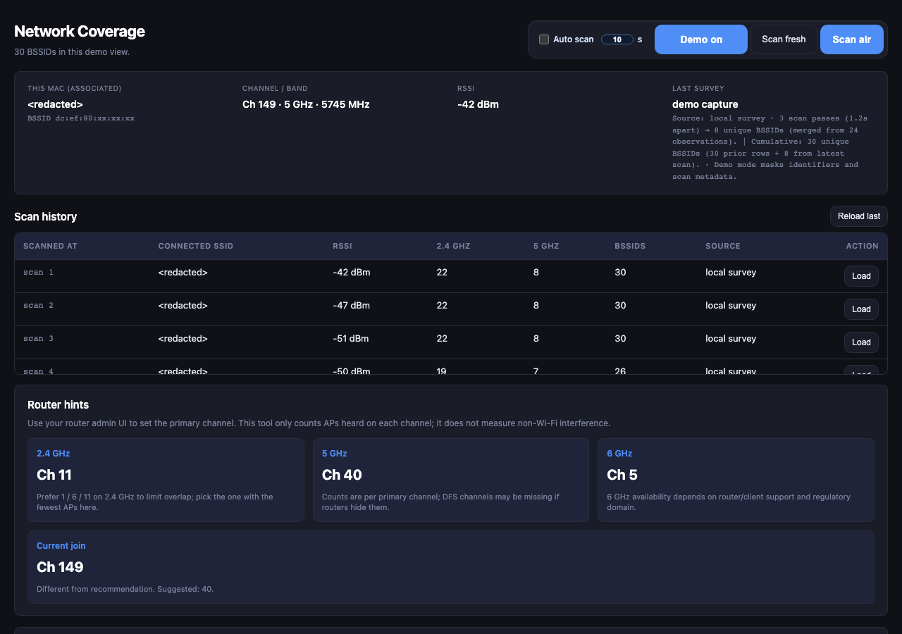
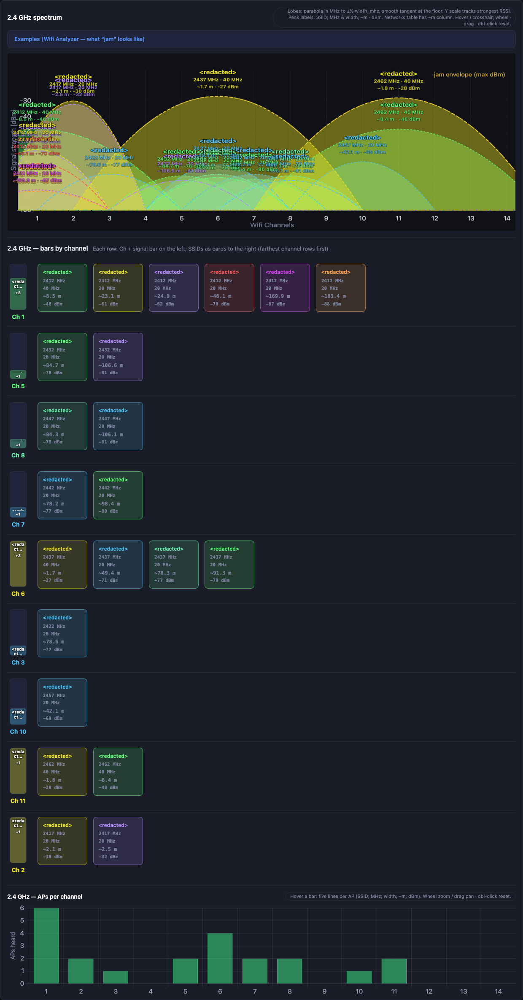
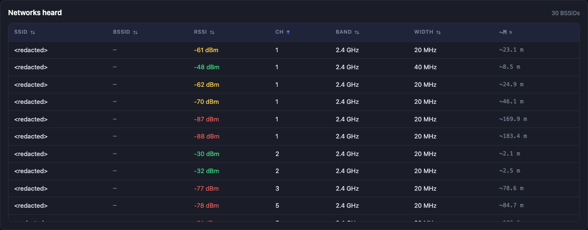
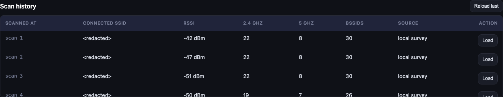

# Network Coverage

A local macOS Wi-Fi survey tool for channel planning.

It scans nearby APs, shows spectrum/channel overlap, estimates rough distance from RSSI, and keeps local scan history.

## 🚀 Big Note

> Feature ideas are always welcome - feel free to open an issue or request.  
> I will do my best to improve this project, but updates depend on available time.  
> You are also welcome to build with your favorite AI tools and share improvements.

## Features

- 2.4 GHz and 5 GHz spectrum visualization
- APs-per-channel histograms with hover details
- Channel-first bar/card layout with per-SSID details
- Scan history table (load previous snapshots)
- Auto-scan with custom interval
- Router channel recommendation hints
- Demo mode for privacy-safe screenshots (`?demo=1` or top-bar button)

## Product Review (GitHub)

`Network Coverage` is a practical local-first Wi-Fi survey app for macOS. It is designed for fast channel diagnostics at home or in small offices without cloud upload or external telemetry.

### What is strong

- Clear spectrum + channel overlap views for both 2.4 GHz and 5 GHz
- Per-AP details (SSID/BSSID, width, RSSI, estimated distance)
- Scan history you can reload for before/after comparison
- Analyzer-style fallback strategy for current-link SSID/BSSID recovery
- Privacy-focused demo mode for public sharing and documentation

### Current limitations

- RSSI distance is an estimate, not physical measurement
- SSID visibility on modern macOS can still be restricted by OS privacy state
- Current persistence is local JSON history (`survey_state.json`), not a database

### Best use cases

- Detect crowded channels before choosing router channel/bandwidth
- Compare scans over time while moving through rooms/floors
- Create reproducible survey snapshots for troubleshooting

## Requirements

- macOS
- Python 3 (system Python recommended on macOS for Wi-Fi APIs)
- Access to CoreWLAN/PyObjC in your Python environment

## Run

From project root:

```bash
./start.sh
```

Open:

```text
http://127.0.0.1:5002/
```

Demo-safe mode:

```text
http://127.0.0.1:5002/?demo=1
```

In Demo mode, identifiers and scan metadata are masked for screenshots.

## Screenshot Plan (Privacy-Safe)

Capture all screenshots with Demo mode enabled.

1) Overview dashboard
- Show main header, associated link panel, and status banner area.
- Goal: communicate that this is a full survey workflow, not just a chart.

2) Spectrum focus
- Show 2.4 GHz and 5 GHz spectrum cards with peak labels.
- Goal: demonstrate overlap/jam visibility and channel density.

3) Channel/AP detail strip
- Show channel-left rows with AP cards on the right.
- Goal: show practical data granularity (MHz, width, RSSI, distance).

4) History table
- Show 5-row scroll viewport and `Load` action buttons.
- Goal: highlight scan persistence and comparison workflow.

Suggested filenames:
- `docs/screenshots/01-overview-demo.png`
- `docs/screenshots/02-spectrum-demo.png`
- `docs/screenshots/03-channel-strip-demo.png`
- `docs/screenshots/04-history-demo.png`

## Screenshots






## Repo Short Description

Local macOS Wi-Fi network coverage analyzer with spectrum overlap, channel/AP detail views, history replay, and privacy-safe demo mode.

## Development

- Frontend: `templates/index.html`, `static/app.js`, `static/style.css`
- Backend: `app.py`, `wifi_environment.py`
- Local state is stored in `survey_state.json` (ignored by git)

## Privacy Notes

- This tool may capture SSID/BSSID, signal values, and local scan metadata.
- Public repo setup should ignore local state and environment files.
- See `.gitignore` for excluded files.
